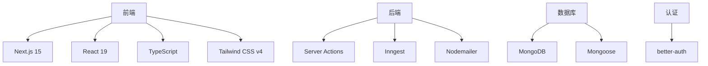
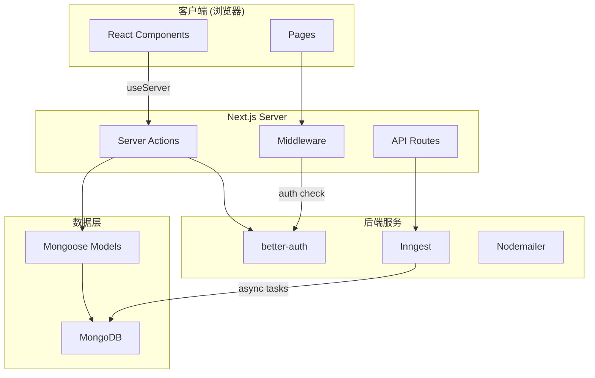
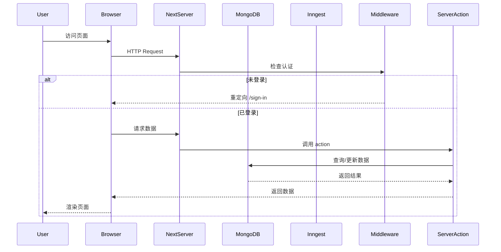
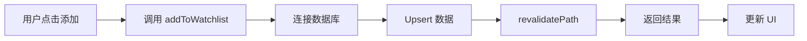

# OpenStock 系统架构设计文档

## 1. 项目概述

OpenStock 是一个开源的股票市场应用，提供实时价格追踪、自定义提醒和公司详细信息功能。

| 属性 | 值 |
|------|-----|
| 项目名称 | OpenStock |
| 版本 | 0.1.0 |
| 许可证 | Private |

## 2. 技术栈



## 3. 目录结构

```
OpenStock/
├── app/                    # Next.js App Router
│   ├── (auth)/            # 认证相关页面
│   │   ├── sign-in/       # 登录页
│   │   └── sign-up/       # 注册页
│   ├── (root)/           # 主应用页面
│   │   ├── watchlist/    # 自选股列表
│   │   ├── stocks/        # 股票详情页
│   │   ├── about/        # 关于页
│   │   ├── help/          # 帮助页
│   │   └── api-docs/      # API 文档
│   ├── api/              # API 路由
│   │   └── inngest/      # Inngest webhook
│   └── layout.tsx        # 根布局
│
├── components/           # React 组件
│   ├── ui/               # 基础 UI 组件 (shadcn)
│   ├── watchlist/        # 自选股相关组件
│   ├── stocks/           # 股票相关组件
│   └── forms/            # 表单组件
│
├── lib/                  # 核心库
│   ├── actions/          # Server Actions
│   │   ├── auth.actions.ts
│   │   ├── watchlist.actions.ts
│   │   ├── alert.actions.ts
│   │   ├── finnhub.actions.ts
│   │   ├── user.actions.ts
│   │   └── adanos.actions.ts
│   ├── better-auth/      # 认证配置
│   ├── inngest/          # 后台任务
│   ├── nodemailer/      # 邮件发送
│   ├── ai-provider.ts   # AI 提供商抽象
│   ├── utils.ts         # 工具函数
│   ├── constants.ts     # 常量定义
│   └── kit.ts           # UI 工具
│
├── database/             # 数据库层
│   ├── mongoose.ts       # MongoDB 连接
│   └── models/           # Mongoose 模型
│       ├── watchlist.model.ts
│       └── alert.model.ts
│
├── hooks/                 # 自定义 Hooks
│
├── middleware/            # Next.js 中间件
│
└── public/                # 静态资源
```

## 4. 系统架构



## 5. 数据流

### 5.1 用户请求流程



### 5.2 自选股操作流程



## 6. 模块说明

### 6.1 认证模块

- **配置**: `lib/better-auth/auth.ts`
- **中间件**: `middleware/index.ts`
- **功能**: 基于 better-auth + MongoDB 的用户认证
- **流程**: Middleware 检查 session cookie，未登录重定向到登录页

### 6.2 数据模型

| 模型 | 用途 | 关键字段 |
|------|------|----------|
| Watchlist | 用户自选股 | userId, symbol, company, addedAt |
| Alert | 价格提醒 | userId, symbol, price, condition |

### 6.3 Server Actions

| Action | 功能 |
|--------|------|
| `addToWatchlist` | 添加自选股 |
| `removeFromWatchlist` | 移除自选股 |
| `getUserWatchlist` | 获取自选股列表 |
| `createAlert` | 创建价格提醒 |
| `getUserAlerts` | 获取提醒列表 |

### 6.4 后台任务

- **配置**: `lib/inngest/client.ts`
- **函数**: `lib/inngest/functions.ts`
- **用途**: 异步任务处理（如价格提醒检查）

## 7. 环境变量

```
MONGODB_URI          # MongoDB 连接字符串
BETTER_AUTH_SECRET  # 认证密钥
BETTER_AUTH_URL     # 认证 Base URL
GEMINI_API_KEY      # Gemini API
MINIMAX_API_KEY     # Minimax API
SIRAY_API_KEY       # Siray API
```

---

## 附录

### 相关文档

| 文档 | 说明 |
|------|------|
| [数据模型详细说明](./data-model.md) | Mongoose 模型定义 |
| [API 和 Actions 详细说明](./api-actions.md) | Server Actions 函数 |
| [组件详细说明](./components.md) | React 组件层级 |
| [环境变量说明](./env-variables.md) | 环境变量配置 |
| [部署说明](./deployment.md) | Docker/Vercel 部署 |