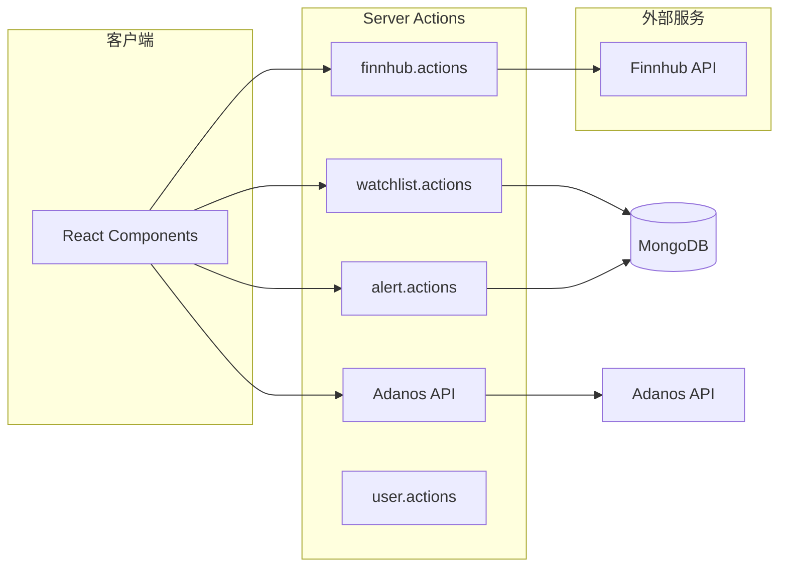

# API 和 Actions 设计

## 1. Server Actions 概述

OpenStock 使用 **Next.js Server Actions** 作为后端逻辑，而非传统 REST API。

### 1.1 特性

| 特性 | 说明 |
|------|------|
| `'use server'` | 声明在服务端执行 |
| 类型安全 | 完整的 TypeScript 类型 |
| 缓存失效 | 使用 `revalidatePath()` 清除缓存 |

## 2. Actions 模块

### 2.1 Watchlist Actions

**文件**: `lib/actions/watchlist.actions.ts`

```typescript
// 添加自选股
async function addToWatchlist(
    userId: string,
    symbol: string,
    company: string
): Promise<WatchlistItem>

// 移除自选股
async function removeFromWatchlist(
    userId: string,
    symbol: string
): Promise<{ success: boolean }>

// 获取用户自选股列表
async function getUserWatchlist(
    userId: string
): Promise<WatchlistItem[]>
```

**流程图**:

```mermaid
flowchart TB
    A["addToWatchlist(userId, symbol, company)"] --> B[connectToDatabase]
    B --> C[Watchlist.findOneAndUpdate]
    C --> D[revalidatePath('/watchlist')]
    D --> E[返回结果]
```

### 2.2 Alert Actions

**文件**: `lib/actions/alert.actions.ts`

```typescript
// 创建价格提醒
async function createAlert(params: {
    userId: string;
    symbol: string;
    targetPrice: number;
    condition: 'ABOVE' | 'BELOW';
}): Promise<IAlert>

// 获取用户所有提醒
async function getUserAlerts(userId: string): Promise<IAlert[]>

// 删除提醒
async function deleteAlert(alertId: string): Promise<{ success: boolean }>

// 切换提醒状态
async function toggleAlert(alertId: string, active: boolean): Promise<{ success: boolean }>
```

### 2.3 Finnhub Actions

**文件**: `lib/actions/finnhub.actions.ts`

Finnhub API 封装，用于获取股票数据。

```typescript
// 获取实时报价
async function getQuote(symbol: string): Promise<{
    c: number;   // 当前价格
    d: number;   // 变动
    dp: number;  // 变动百分比
    h: number;   // 最高
    l: number;   // 最低
    o: number;   // 开盘
    pc: number;  // 前收盘
    t: number;  // 时间戳
}>

// 获取公司信息
async function getCompanyProfile(symbol: string): Promise<CompanyProfile>

// 获取自选股数据
async function getWatchlistData(symbols: string[]): Promise<QuoteWithSymbol[]>

// 获取新闻
async function getStockNews(symbol: string): Promise<NewsArticle[]>
```

**缓存策略**:

| API | 缓存时间 |
|-----|----------|
| getQuote | 无缓存 (实时) |
| getCompanyProfile | 24 小时 |
| getStockNews | 1 小时 |

### 2.4 Adanos Actions

**文件**: `lib/actions/adanos.actions.ts`

AI 情感分析 API 封装。

```typescript
// 获取股票情感分析
async function getStockSentimentInsights(
    symbol: string,
    source?: SentimentSourceKey
): Promise<StockSentimentInsights>
```

### 2.5 User Actions

**文件**: `lib/actions/user.actions.ts`

```typescript
// 获取所有用户信息 (用于邮件通知)
async function getAllUsersForNewsEmail(): Promise<{
    id: string;
    email: string;
    name: string;
}[]>
```

## 3. Actions 关系图



## 4. 认证 Actions

**文件**: `lib/actions/auth.actions.ts`

基于 better-auth 的认证操作封装。

```typescript
// 登录/注册使用 better-auth 内置
// 通过客户端表单调用
```

## 5. 后台任务 (Inngest)

**文件**: `lib/inngest/functions.ts`

```typescript
// 价格提醒检查
async function checkPriceAlerts(): Promise<void>

// 新闻邮件发送
async function sendNewsEmails(): Promise<void>
```

---

## Appendix

- 相关数据模型: [数据模型详细说明](./data-model.md)
- 系统架构: [架构设计](./ARCHITECTURE.md)
- 环境变量: [环境变量说明](./env-variables.md)