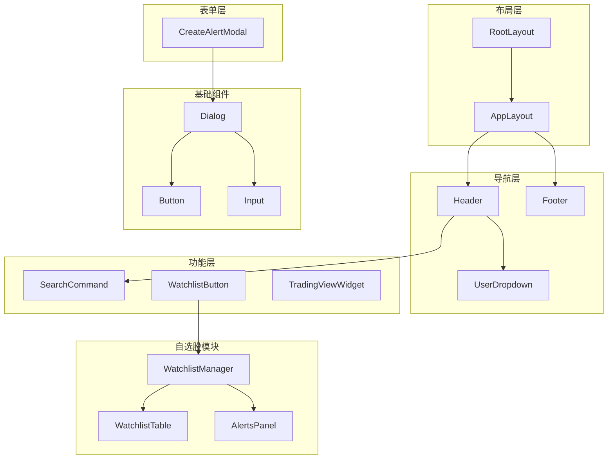
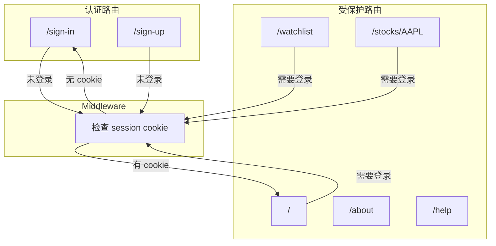

# 组件设计

## 1. 组件概览

OpenStock 使用 **Next.js App Router** + **React 19** 构建界面，采用组件化设计。

### 1.1 目录结构

```
components/
├── ui/               # 基础 UI 组件 (shadcn/ui 风格)
│   ├── button.tsx
│   ├── dialog.tsx
│   ├── input.tsx
│   ├── select.tsx
│   ├── popover.tsx
│   ├── dropdown-menu.tsx
│   ├── avatar.tsx
│   ├── label.tsx
│   ├── command.tsx   # Cmd+K 搜索
│   └── sonner.tsx    # Toast 通知
│
├── forms/            # 表单组件
│   ├── InputField.tsx
│   ├── SelectField.tsx
│   └── CountrySelectField.tsx
│
├── watchlist/        # 自选股相关组件
│   ├── WatchlistManager.tsx
│   ├── WatchlistTable.tsx
│   ├── WatchlistStockChip.tsx
│   ├── TradingViewWatchlist.tsx
│   ├── AlertsPanel.tsx
│   ├── CreateAlertModal.tsx
│   └── NewsGrid.tsx
│
├── stocks/           # 股票相关组件
│   └── StockSentimentCard.tsx
│
├── Header.tsx        # 顶部导航
├── Footer.tsx        # 底部
├── UserDropdown.tsx  # 用户下拉菜单
├── SearchCommand.tsx # 搜索命令 (Cmd+K)
├── WatchlistButton.tsx  # 自选股按钮
├── DonatePopup.tsx    # 捐赠弹窗
├── TradingViewWidget.tsx  # 股票图表
├── NavItems.tsx       # 导航项
├── SirayBanner.tsx   # Siray 广告
└── OpenDevSocietyBranding.tsx  # 品牌
```

## 2. 组件层级



## 3. 核心组件

### 3.1 Header

**文件**: `components/Header.tsx`

| 属性 | 类型 | 说明 |
|------|------|------|
| user | User | 当前用户信息 |

```typescript
// Server Component
const Header = async ({ user }: { user: User }) => {
    // 获取初始股票数据
    // 渲染导航和用户菜单
}
```

### 3.2 WatchlistManager

**文件**: `components/watchlist/WatchlistManager.tsx`

自选股管理主组件，协调子组件。

```typescript
// Client Component
const WatchlistManager = () => {
    // 管理自选股列表
    // 管理价格提醒
}
```

### 3.3 SearchCommand

**文件**: `components/SearchCommand.tsx`

Cmd+K 搜索组件，使用 `cmdk` 库。

```typescript
// Client Component
const SearchCommand = () => {
    // 搜索股票
    // 添加到自选股
}
```

### 3.4 TradingViewWidget

**文件**: `components/TradingViewWidget.tsx`

TradingView 图表组件。

```typescript
// Client Component
const TradingViewWidget = ({
    symbol,
    theme = 'dark'
}) => {
    // 渲染 K 线图
}
```

## 4. 页面结构

### 4.1 路由

```
app/
├── (auth)/              # 认证路由组
│   ├── sign-in/        # 登录页
│   └── sign-up/        # 注册页
│
├── (root)/             # 主应用路由组
│   ├── watchlist/      # 自选股页
│   ├── stocks/[symbol]/ # 股票详情页
│   ├── about/          # 关于页
│   ├── help/           # 帮助页
│   └── api-docs/       # API 文档页
│
├── api/                # API 路由
│   └── inngest/        # Inngest webhook
│
└── layout.tsx           # 根布局
```

### 4.2 页面布局图



## 5. UI 组件库

基于 **shadcn/ui** 模式的基础组件：

| 组件 | 用途 |
|------|------|
| Button | 按钮 |
| Input | 输入框 |
| Dialog | 对话框 |
| Select | 下拉选择 |
| Popover | 气泡弹出 |
| DropdownMenu | 下拉菜单 |
| Avatar | 头像 |
| Label | 标签 |
| Command | 命令搜索 |

---

## Appendix

- 系统架构: [架构设计](./ARCHITECTURE.md)
- 数据模型: [数据模型详细说明](./data-model.md)
- API 和 Actions: [API 和 Actions 详细说明](./api-actions.md)