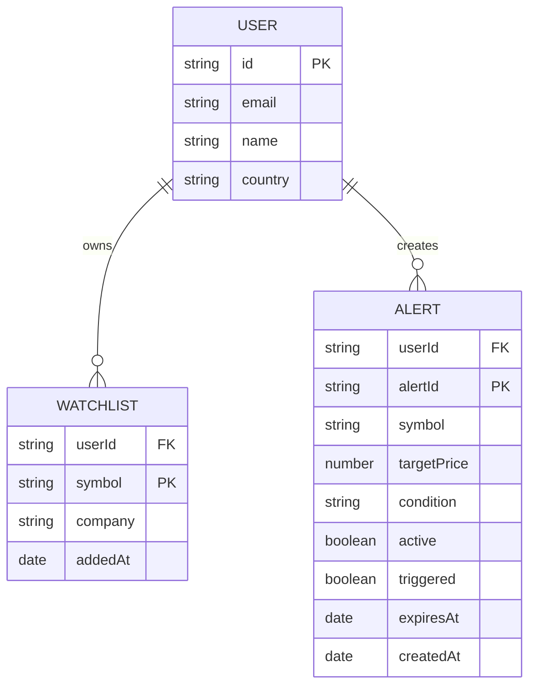

# 数据模型设计

## 1. 数据库连接

### 1.1 连接配置

**文件**: `database/mongoose.ts`

```typescript
export const connectToDatabase = async () => {
    // 使用 mongoose.connect() 连接 MongoDB
    // 包含缓存机制防止重复连接
    // 使用 IPv4 避免 DNS 查询问题
}
```

### 1.2 连接特性

| 特性 | 说明 |
|------|------|
| 连接缓存 | 全局缓存避免重复连接 |
| DNS 配置 | 强制 IPv4 (setDefaultResultOrder + setServers) |
| 连接池 | Mongoose 默认连接池 |

## 2. Mongoose 模型

### 2.1 Watchlist (自选股)

**文件**: `database/models/watchlist.model.ts`

```typescript
interface WatchlistItem extends Document {
    userId: string;      // 用户 ID
    symbol: string;    // 股票代码 (大写)
    company: string;   // 公司名称
    addedAt: Date;     // 添加时间
}
```

**Schema 定义**:

| 字段 | 类型 | 约束 | 说明 |
|------|------|------|------|
| userId | String | required, indexed | 用户标识 |
| symbol | String | required, uppercase, trim | 股票代码 |
| company | String | required, trim | 公司名称 |
| addedAt | Date | default: now | 添加时间 |

**索引**:

```typescript
// 复合唯一索引: 每个用户每个 symbol 只能出现一次
{ userId: 1, symbol: 1 }, { unique: true }
```

### 2.2 Alert (价格提醒)

**文件**: `database/models/alert.model.ts`

```typescript
interface IAlert extends Document {
    userId: string;         // 用户 ID
    symbol: string;       // 股票代码
    targetPrice: number;   // 目标价格
    condition: 'ABOVE' | 'BELOW';  // 触发条件
    active: boolean;      // 是否激活
    triggered: boolean;  // 是否已触发
    expiresAt: Date;      // 过期时间
    createdAt: Date;      // 创建时间
}
```

**Schema 定义**:

| 字段 | 类型 | 约束 | 说明 |
|------|------|------|------|
| userId | String | required, indexed | 用户标识 |
| symbol | String | required, uppercase | 股票代码 |
| targetPrice | Number | required | 目标价格 |
| condition | String | enum: [ABOVE, BELOW] | 触发条件 |
| active | Boolean | default: true | 是否激活 |
| triggered | Boolean | default: false | 是否已触发 |
| expiresAt | Date | default: +90days | 过期时间 (90天) |
| createdAt | Date | default: now | 创建时间 |

## 3. 数据模型图



## 4. 数据操作

### 4.1 Watchlist 操作

| 操作 | 方法 | 说明 |
|------|------|------|
| 添加自选股 | `Watchlist.findOneAndUpdate()` | upset: true 防重复 |
| 移除自选股 | `Watchlist.findOneAndDelete()` | 按 userId + symbol 删除 |
| 获取列表 | `Watchlist.find()` | 按添加时间倒序 |

### 4.2 Alert 操作

| 操作 | 方法 | 说明 |
|------|------|------|
| 创建提醒 | `Alert.create()` | 创建新提醒 |
| 获取列表 | `Alert.find()` | 获取用户所有提醒 |
| 删除提醒 | `Alert.findByIdAndDelete()` | 按 ID 删除 |
| 切换状态 | `Alert.findByIdAndUpdate()` | 启用/禁��提醒 |

---

## Appendix

- 相关 Server Actions: [API 和 Actions 详细说明](./api-actions.md)
- 系统架构: [架构设计](./ARCHITECTURE.md)