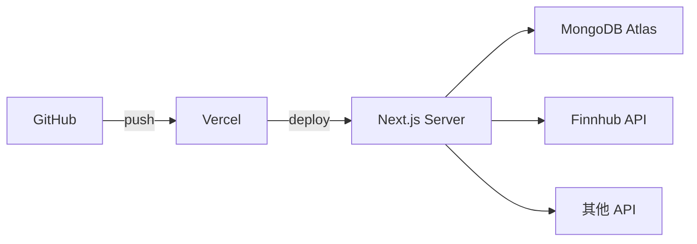
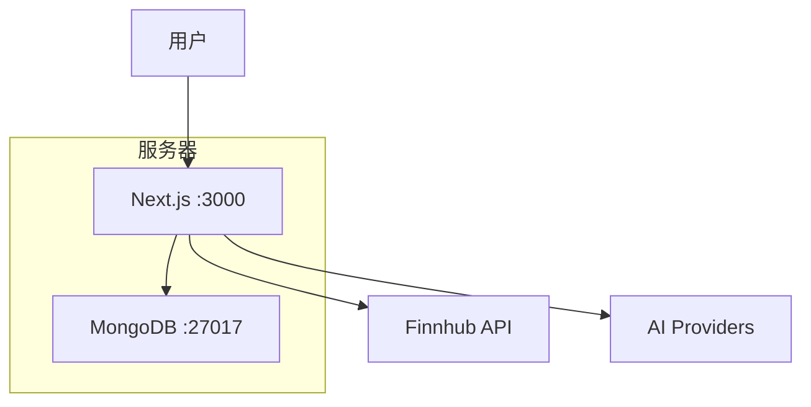
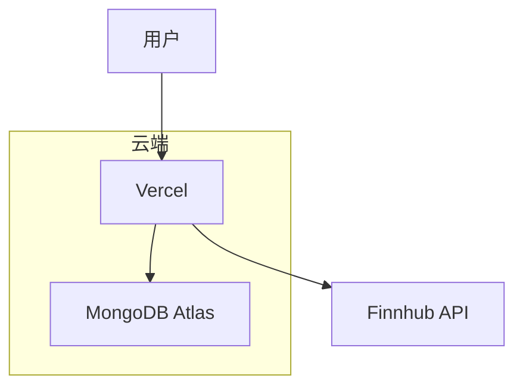

# 部署说明

## 1. 部署方式

OpenStock 支持多种部署方式：

| 方式 | 适合场景 | 优点 | 缺点 |
|------|----------|------|------|
| Docker Compose | 本地开发/测试 | 一键启动 | 无弹性扩展 |
| Docker 单机 | 小型生产 | 简单可控 | 需要手动管理 |
| Vercel | 生产 (推荐) | 免费 + 自动扩展 | 需外部 MongoDB |
| 自托管 | 生产 | 完全控制 | 需要运维 |

## 2. Docker 部署

### 2.1 使用 Docker Compose

```bash
# 启动所有服务
docker-compose up -d

# 查看日志
docker-compose logs -f

# 停止服务
docker-compose down
```

**包含服务**:
- `openstock`: Next.js 应用 (端口 3000)
- `mongodb`: MongoDB 7 (端口 27017)

### 2.2 使用 Dockerfile

```bash
# 构建镜像
docker build -t openstock .

# 运行容器
docker run -p 3000:3003 --env-file .env openstock
```

## 3. Vercel 部署 (推荐)

### 3.1 部署步骤

1. **推送代码到 GitHub**

2. **在 Vercel 导入项目**
   - 访问: https://vercel.com/new
   - 选择 GitHub 仓库

3. **配置环境变量**
   - `MONGODB_URI`: MongoDB Atlas 连接字符串
   - `BETTER_AUTH_SECRET`: 认证密钥
   - `BETTER_AUTH_URL`: `https://your-app.vercel.app`
   - 其他 API Key

4. **部署**

### 3.2 Vercel 架构



### 3.3 MongoDB Atlas 配置

1. **创建免费集群**: https://www.mongodb.com/cloud/atlas

2. **配置网络访问**
   - 添加 `0.0.0.0/0` (测试) 或 Vercel IP

3. **获取连接字符串**
   ```
   mongodb+srv://<username>:<password>@cluster.mongodb.net/openstock
   ```

## 4. 生产环境配置

### 4.1 Next.js 配置

**文件**: `next.config.ts`

```typescript
const nextConfig: NextConfig = {
    devIndicators: false,
    images: {
        remotePatterns: [
            { protocol: 'https', hostname: 'i.ibb.co' },
            { protocol: 'https', hostname: 'static2.finnhub.io' },
        ],
    },
    eslint: { ignoreDuringBuilds: true },
    typescript: { ignoreBuildErrors: true },
};
```

### 4.2 构建命令

```bash
# 开发
npm run dev

# 生产构建
npm run build

# 生产运行
npm run start
```

### 4.3 端口配置

| 环境 | 端口 |
|------|------|
| 开发 | 3000 |
| 生产 | 3000 |

## 5. 系统架构

### 5.1 单机部署



### 5.2 Vercel 部署



## 6. 监控和维护

### 6.1 健康检查

```bash
# 检查应用
curl http://localhost:3000

# 检查 MongoDB
mongosh --eval "db.adminCommand('ping')"
```

### 6.2 日志

```bash
# Docker
docker-compose logs -f openstock

# 本地
npm run dev
```

---

## Appendix

- 环境变量: [环境变量说明](./env-variables.md)
- 系统架构: [架构设计](./ARCHITECTURE.md)