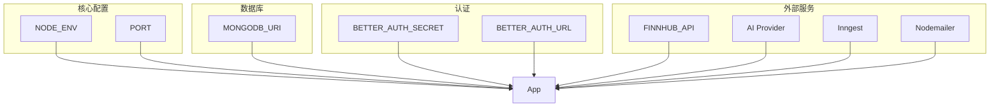

# 环境变量说明

## 1. 环境变量列表

### 1.1 核心配置

| 变量名 | 必需 | 默认值 | 说明 |
|--------|------|--------|------|
| `NODE_ENV` | 是 | `development` | 运行环境 |
| `PORT` | 否 | `3000` | 服务端口 |

### 1.2 数据库

| 变量名 | 必需 | 默认值 | 说明 |
|--------|------|--------|------|
| `MONGODB_URI` | 是 | - | MongoDB 连接字符串 |

**格式**: `mongodb://[host]:[port]/[database]`

### 1.3 认证

| 变量名 | 必需 | 说明 |
|--------|------|------|
| `BETTER_AUTH_SECRET` | 是 | 认证密钥 (使用 `openssl rand -base64 32` 生成) |
| `BETTER_AUTH_URL` | 是 | 认证 Base URL (如 `http://localhost:3000`) |

### 1.4 股票数据 API

| 变量名 | 必需 | 说明 |
|--------|------|------|
| `NEXT_PUBLIC_FINNHUB_API_KEY` | 是 | Finnhub API Key (免费注册: https://finnhub.io/) |
| `FINNHUB_BASE_URL` | 否 | Finnhub API 地址 |

### 1.5 市场数据提供商 (可选)

| 变量名 | 默认值 | 说明 |
|--------|--------|------|
| `SSE_PROVIDER` | `sina` | 上海证券交易所数据提供商 |
| `SSE_FALLBACK_PROVIDER` | `tencent` | SSE 备选提供商 |
| `SZSE_PROVIDER` | `sina` | 深圳证券交易所数据提供商 |
| `SZSE_FALLBACK_PROVIDER` | `tencent` | SZSE 备选提供商 |
| `US_PROVIDER` | `finnhub` | 美股数据提供商 |
| `SINA_BASE_URL` | `http://hq.sinajs.cn/list=` | Sina API 基础地址 |

### 1.6 AI 提供商 (可选)

| 变量名 | 说明 |
|--------|------|
| `AI_PROVIDER` | AI 提供商 (`gemini` / `minimax` / `siray`) |
| `GEMINI_API_KEY` | Gemini API Key |
| `MINIMAX_API_KEY` | Minimax API Key |
| `SIRAY_API_KEY` | Siray API Key |

### 1.7 后台任务 (可选)

| 变量名 | 说明 |
|--------|------|
| `INNGEST_SIGNING_KEY` | Inngest 签名密钥 |

### 1.8 邮件 (可选)

| 变量名 | 说明 |
|--------|------|
| `NODEMAILER_EMAIL` | Gmail 地址 |
| `NODEMAILER_PASSWORD` | Gmail 应用密码 |

### 1.9 情感分析 (可选)

| 变量名 | 说明 |
|--------|------|
| `ADANOS_API_KEY` | Adanos API Key |

## 2. 环境变量关系图



## 3. 本地开发配置

### 3.1 创建 .env 文件

```bash
# 复制示例配置
cp .env.example .env

# 或手动创建
```

### 3.2 生成认证密钥

```bash
# 生成 BETTER_AUTH_SECRET
openssl rand -base64 32
```

### 3.3 获取 API Key

| 服务 | 注册地址 |
|------|---------|
| Finnhub | https://finnhub.io/ |
| Gemini | https://aistudio.google.com/app/apikey |
| Inngest | https://www.inngest.com/ |

## 4. 生产环境配置

### 4.1 推荐配置

| 变量 | 生产环境值 |
|------|----------|
| `NODE_ENV` | `production` |
| `MONGODB_URI` | MongoDB Atlas 或自托管 |
| `BETTER_AUTH_SECRET` | 安全的随机密钥 |
| `BETTER_AUTH_URL` | 生产域名 |

### 4.2 安全建议

1. **不要提交 .env** - 已在 `.gitignore` 中排除
2. **使用密钥管理** - 如 Vercel Environment Variables
3. **定期轮换** - 定期更换认证密钥

---

## Appendix

- 系统架构: [架构设计](./ARCHITECTURE.md)
- 部署配置: [部署说明](./deployment.md)